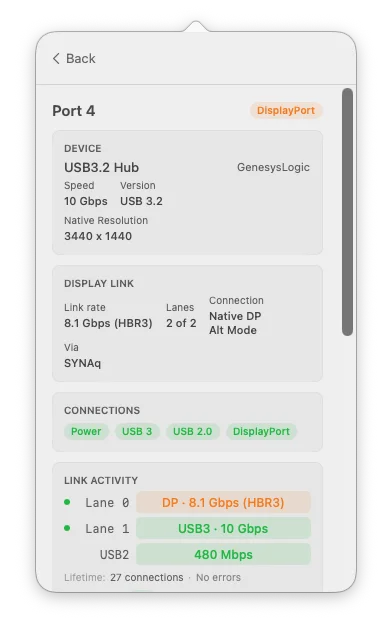
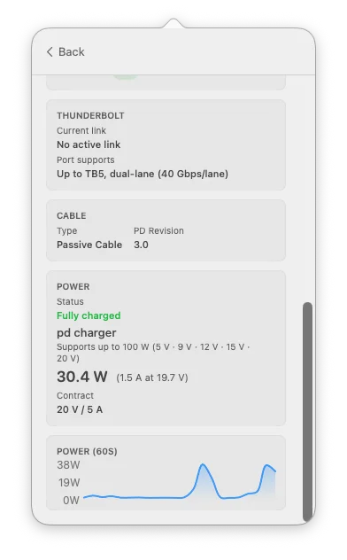
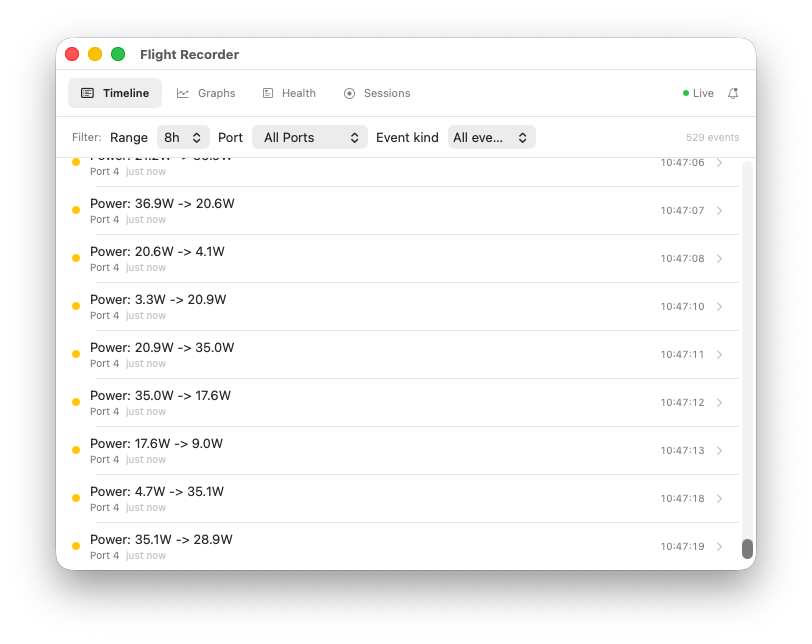
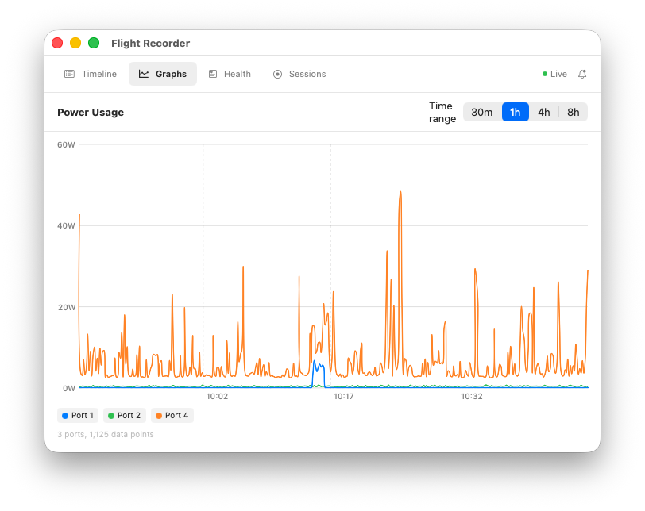
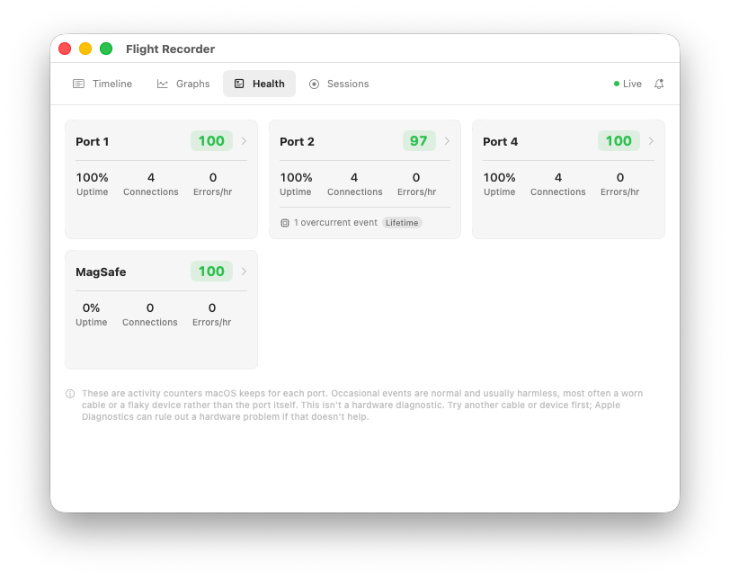
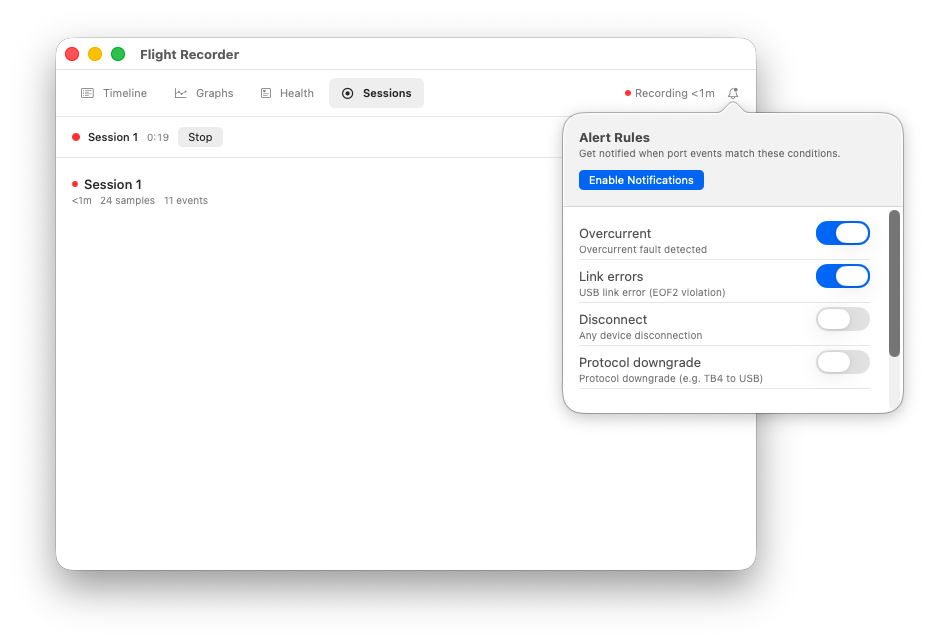

# WhatPort

[](https://github.com/darrylmorley/whatport/releases)
[](https://github.com/darrylmorley/whatport)
[](https://github.com/darrylmorley/whatport/blob/main/LICENSE)

A lightweight macOS menu bar utility that shows real-time USB-C and Thunderbolt port status. See what's connected, how fast it's running, and how much power each port is using.

Free and open source. Apple Silicon only (M1 and later).

<p align="center">
  
  
  
</p>

## Features

- **Port overview** at a glance from the menu bar, with active count and power in/out
- **Protocol detection** for Thunderbolt 3/4/5, DisplayPort alt-mode, USB3, and USB2
- **Live lane status** showing exactly which lanes are carrying data and at what speed
- **Connections** showing what the port has actually set up, and flagging anything macOS has blocked (the usual reason a dock's USB or display won't work)
- **Display detail** with link rate (HBR2/HBR3), lanes in use, native versus Thunderbolt-tunnelled, connected display count, and any hub or HDMI converter in the chain
- **Power monitoring** with real-time wattage, voltage, current, and a 60-second rolling graph
- **Charging status** that says why a connected charger isn't charging: charging, fully charged, held to protect battery health, or just not charging
- **Device and dock identification** including product name, vendor, serial number, USB version, and the connected Thunderbolt dock's own name
- **Charger identification** naming the adapter and listing its full advertised power menu
- **Cable info** showing cable type and USB PD revision
- **Liquid detection** flagging a wet port (M3 and later)
- **Thunderbolt capability** showing max supported speed and lane width per port
- **Port statistics** with lifetime connection counts and error tracking
- **MagSafe support** with charging status and power draw
- **Menu and shortcuts** with a right-click menu for Settings, GitHub, About, and Quit, plus the standard Cmd+, and Cmd+Q

## WhatPort Pro: the Flight Recorder

The live view tells you what your ports are doing right now. The **Flight Recorder** keeps watching when you're not, so you can catch the intermittent faults that only show up when nobody's looking. It runs always-on in the background, records each port's power, protocol, and link state to a local database, and survives restarts.

<p align="center">
  
  
</p>
<p align="center">
  
  
</p>

- **Event timeline.** Every plug, unplug, protocol change, and power event over time, filterable by port and event kind.
- **Power graphs.** Power draw for every port across a selectable time range, with disk-backed history so it survives a restart.
- **Port health scoring.** Each port scored by how often faults recur, with a clear "not a hardware diagnosis" note. Reset the baseline once you've dealt with something.
- **Alerts.** Get notified on overcurrent, link error, disconnect, or protocol downgrade.
- **Sessions.** Bookmark a stretch of recording, name it, and export it to JSON or CSV.
- **Survives an overnight kill.** With Launch at Login on, it restarts itself within seconds if macOS stops it to free memory. A deliberate Quit still quits.

**£4.99 one-time, works on up to 2 Macs.** Secure checkout via Stripe; your licence key is emailed instantly. [Buy WhatPort Pro at whatport.app](https://www.whatport.app/#pro).

The base app in this repository is the free, open-source half. The Flight Recorder is the paid part and is not included in the open-source build.

## Install

Download the latest release from the [releases page](https://github.com/darrylmorley/whatport/releases), unzip, and drag `WhatPort.app` to your Applications folder. Or with [Homebrew](https://brew.sh):

```bash
brew install --cask darrylmorley/whatport/whatport
```

The app is signed and notarized by Apple.

## Requirements

- macOS 14.0 (Sonoma) or later
- Apple Silicon Mac (M1, M2, M3, M4, or later)

## Build from source

Pure SwiftPM, no Xcode project needed:

```bash
git clone https://github.com/darrylmorley/whatport.git
cd whatport
make app        # assemble WhatPort.app
```

`swift build` compile-checks without producing a runnable bundle, `make app` assembles the `.app`, and `make run` launches it. No entitlements or root access needed, all IOKit reads are unprivileged.

## How it works

WhatPort correlates several unprivileged IOKit and SMC services per physical port. The main ones:

1. **AppleTypeCPhy** for USB-C lane state (transport protocol, power level per lane)
2. **IOThunderboltPort** for Thunderbolt link speed, width, and capability
3. **SMC and USB-PD** for power, split into power in and power out (watts, voltage, current per port)

Connection events are detected via IOKit interest notifications for sub-second response. All state (connections, power, transports) is also polled every second as a safety net.

No analytics, no telemetry, no network requests. The app reads local IOKit data and nothing else.

## Architecture

Three layers, each depending only on the one below:

```
SwiftUI (WhatPort)  ->  Domain (WhatPortCore)  ->  IOKit (WhatPortIOKit)
```

- **WhatPortIOKit**: All IOKit C API interaction. Nothing above this layer touches C pointers or IORegistry.
- **WhatPortCore**: Pure Swift domain model and correlation logic. No IOKit or UI imports.
- **WhatPort**: SwiftUI views and formatting. No data fetching or business logic.

## License

[MIT](LICENSE)
