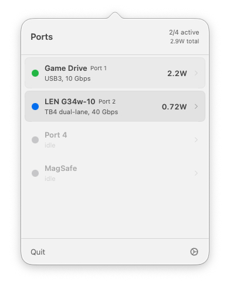
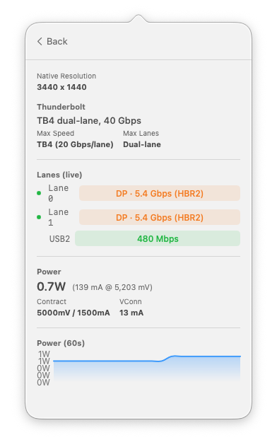
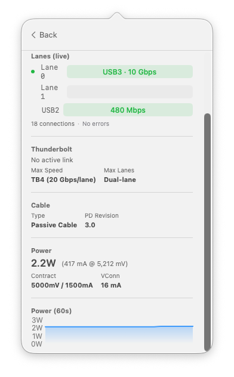

# WhatPort

[](https://github.com/darrylmorley/whatport/releases)
[](https://github.com/darrylmorley/whatport)
[](https://github.com/darrylmorley/whatport/blob/main/LICENSE)

A lightweight macOS menu bar utility that shows real-time USB-C and Thunderbolt port status. See what's connected, how fast it's running, and how much power each port is using.

Apple Silicon only (M1 and later).

<p align="center">
  
  
  
</p>

## Features

- **Port overview** at a glance from the menu bar, with active count and total power draw
- **Protocol detection** for Thunderbolt 3/4/5, DisplayPort alt-mode, USB3, and USB2
- **Live lane status** showing exactly which lanes are carrying data and at what speed
- **Power monitoring** with real-time wattage, voltage, current, and a 60-second rolling graph
- **Device identification** including product name, vendor, serial number, and USB version
- **Cable info** showing cable type and USB PD revision
- **Display resolution** for connected monitors
- **Thunderbolt capability** showing max supported speed and lane width per port
- **Port statistics** with lifetime connection counts and error tracking
- **MagSafe support** with charging status and power draw

## Install

Download the latest release from the [releases page](https://github.com/darrylmorley/whatport/releases), unzip, and drag `WhatPort.app` to your Applications folder. The app is signed and notarized by Apple.

## Requirements

- macOS 14.0 (Sonoma) or later
- Apple Silicon Mac (M1, M2, M3, M4, or later)

## Build from source

```bash
git clone https://github.com/darrylmorley/whatport.git
cd whatport
xcodebuild -scheme WhatPort -configuration Release -destination 'platform=macOS' build
```

The built binary will be in `DerivedData`. No entitlements or root access needed, all IOKit reads are unprivileged.

## How it works

WhatPort reads real-time data from three IOKit service layers:

1. **AppleTypeCPhy** for USB-C lane state (transport protocol, power level per lane)
2. **IOThunderboltPort** for Thunderbolt link speed, width, and capability
3. **AppleSmartBattery** for power delivery data (watts, voltage, current per port)

Connection events are detected via IOKit interest notifications on `IOPortTransportStateCC` services. Power data is polled every 3 seconds. No polling is done for connection state.

## Architecture

Three layers, each depending only on the one below:

```
SwiftUI (WhatPort)  ->  Domain (WhatPortCore)  ->  IOKit (WhatPortIOKit)
```

- **WhatPortIOKit**: All IOKit C API interaction. Nothing above this layer touches C pointers or IORegistry.
- **WhatPortCore**: Pure Swift domain model and correlation logic. No IOKit or UI imports.
- **WhatPort**: SwiftUI views and formatting. No data fetching or business logic.

## License

[MIT](LICENSE)
